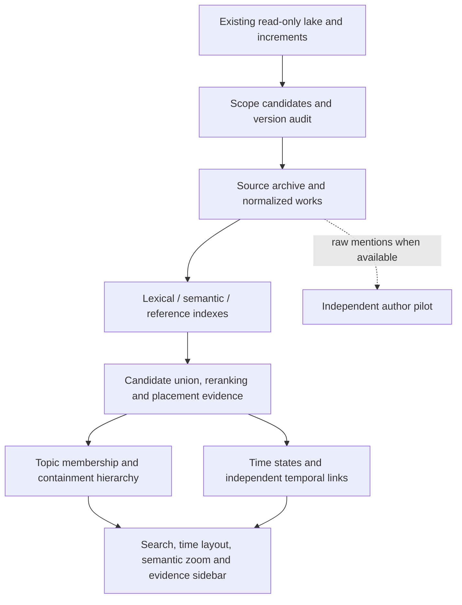

# Architecture

This repository starts with exploration, not a platform claim. The acceptance question is whether a new paper can be placed in a reasonable fine research direction with relevant predecessors and inspectable evidence.

## Boundaries

- `data`: read-only source inventory, version resolution, archival, normalization. Original fields are preserved separately from model features.
- `scope`: text/source/verified-seed candidate recall, human scope decisions; topic entities are not hard boundaries.
- `retrieval` / `encoding`: BM25 and separately versioned scientific/multilingual representations. Inputs start with title/abstract only.
- `relations`: direct references, normalized shared-reference evidence and semantic similarity are distinct. Incoming citations derive by reversing reference edges, with coverage disclosed.
- `positioning`: union recall, independently inspectable ranking, topic support and refusal. The initial baseline may expose provisional human directions before automatic topics exist.
- `topics`: fine groups, membership and explicitly nested containment; does not declare historical splits.
- `temporal`: time states and evidence-backed links; no inferred evolution from a cluster dendrogram.
- `views`: stable publication-time radii, containment/time aggregation, counts and selected cross-links. G6 5.1.1 (`54ece372b40aa8ecbf09add9e09544979a4be10f`) is the pinned renderer. Publication-time radius is a custom `BaseLayout`, not a built-in layout.
- `evaluation` / `incremental`: independent labels, leakage isolation, reproducibility, version alignment and stability.

`apps/api` is a thin local service over reviewed artifacts; `apps/web` renders them. P02 pins are recorded in `docs/decisions/ADR-0001-components.md` and `docs/decisions/component_inventory.json`: bm25s for lexical search, Faiss `IndexFlatIP` for exact vectors, Vue 3.5.43 and Nuxt 4.4.8 for the UI shell, and G6 5.1.1 for the graph view. Checkpoints remain candidates and are not distributed. Do not fork unadopted platforms. The local API is a thin adapter in P12, not the World Pub Monitor service.

`experiments/bootstrap_20261008` preserves the initial single-partition toolkit and synthetic engineering tests. Formal modules are currently reserved directories. Nothing imports that toolkit as an accepted complete data pipeline.

## Machines and evidence

The lake machine supplies data; Spark supplies conditional compute. Addresses come from local environment. Current memory/clocks/disk are user-reported in `configs/compute/reported_constraints.json`, not measured by this project. CPU BM25 and data audit precede model training. A service stop is not hidden inside data extraction.

## Execution order

Audit source/versions → audit components → normalize tiny real slice → define scope and archive candidates → pilot/independent labels → lexical/scientific/multilingual baselines → citation comparison → new-paper placement → hierarchy/time states → true-data UI → increment stability → evidence-based next-phase decision. Author pilot is conditional and independent.

## Component audit

P02 measured library loads on an Apple M4 Max (arm64, macOS 26.5.2). It did not measure the Spark machines, did not download encoder weights, and did not choose a project license. Model revisions and the unverified checkpoint licenses are in `configs/models/candidate_models.json`.
